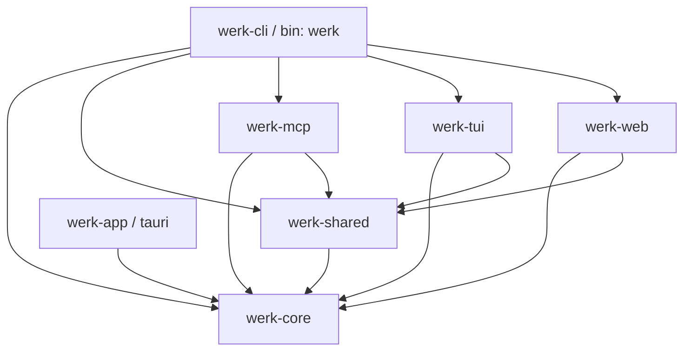

# AUDIT: Circular / Tangled Dependencies

Branch: `worktree-agent-abca661c`
Scope: crate-level (Cargo.toml) + module-level (intra-crate `use crate::…`) across the `werk` Rust workspace.
Method: `cargo tree`, raw `grep` of `use crate::` / `use super::`, Python-built adjacency / bidirectional-edge detector.

## TL;DR

**No cycles found. No bidirectional module tangles. Crate layering is clean and matches the intended architecture.**

The workspace is in good shape on this axis. The one nameable smell — a set of backward-compat re-export shims in `werk-cli/src/lib.rs` — is intentional, non-cyclic, and would cost ~35 file edits to remove with no functional benefit. It is left documented, not implemented.

---

## 1. Crate Dependency Graph

Edges from `cargo tree --workspace` (internal path deps only):

```
                    ┌──────────────┐
                    │  werk-core   │  (base; pure — no instrument deps)
                    └──────┬───────┘
                           │
             ┌─────────────┼──────────────┐
             │             │              │
      ┌──────▼─────┐  ┌────▼─────┐  ┌─────▼─────┐
      │ werk-shared│  │ werk-app │  │  (nothing  │
      │            │  │ (tauri)  │  │   else)   │
      └──────┬─────┘  └──────────┘  └───────────┘
             │
   ┌─────────┼────────────┬──────────────┐
   │         │            │              │
┌──▼───┐ ┌───▼────┐  ┌────▼────┐   ┌─────▼─────┐
│ mcp  │ │  tui   │  │   web   │   │ werk-cli  │
└──┬───┘ └───┬────┘  └────┬────┘   │ (binary)  │
   │         │             │       └─────┬─────┘
   │         │             │             │
   └─────────┴─────────────┴─────────────┘
                (werk-cli pulls mcp, tui, web,
                 shared, core — one call each:
                 werk_mcp::run_server,
                 werk_tui::run,
                 werk_web::serve_on)
```

Mermaid equivalent:



### Assessment against the task's intended layering

| Rule | Holds? |
|---|---|
| `werk-core` is the base, pure, no instrument deps | YES |
| `werk-shared` sits above core, below UI crates | YES |
| UI crates (`werk-cli`, `werk-tui`, `werk-web`, `werk-app`) do not depend on each other | YES with one expected exception: `werk-cli` depends on `werk-tui`, `werk-web`, `werk-mcp` because `werk-cli` is the composite binary that dispatches to the others. `werk-tui`, `werk-web`, `werk-app` never depend on each other or on `werk-cli`. |

**No crate-level cycles possible** (cargo would refuse to build otherwise), and **no fat / surprising cross-crate dependencies**. Each UI crate is called by `werk-cli` through exactly one entrypoint:

| Call | File | Line |
|---|---|---|
| `werk_tui::run()` | `werk-cli/src/main.rs` | 75 |
| `werk_mcp::run_server()` | `werk-cli/src/main.rs` | 371 |
| `werk_web::serve_on(...)` | `werk-cli/src/commands/serve.rs` | 71 |

No "whole crate pulled for one helper" cases.

`werk-app` (Tauri desktop) depends only on `werk-core` — it deliberately does **not** pull `werk-shared`. That is defensible (the desktop app reimplements its own tiny workspace discovery) but is also a small duplication risk. Classification: **intentional / accepted**.

`werk-tab` is a browser extension (JS/HTML), **not a Rust crate** — out of scope.

---

## 2. Module-Level Analysis

Method:
- For every `*.rs` file in each crate, extract `use crate::<mod>` / `use super::<mod>` references.
- Build a directed adjacency graph per crate.
- Flag (a) bidirectional edges (A uses B and B uses A), (b) deep `super::super::super::…` chains, (c) over-broad `pub use`.

### Bidirectional module edges

```
werk-core   : none
werk-shared : none
werk-cli    : none
werk-tui    : none
werk-mcp    : n/a (single module file: tools.rs)
werk-web    : n/a (single module file: lib.rs)
```

Zero bidirectional edges across the entire workspace. This is remarkable and a deliberate architectural win.

### Deep `super` chains

```
^use super::super::      : 0 hits
^use super::super::super::: 0 hits
```

No module is pulling its own grandparent. All `use super::` usage is single-step and idiomatic.

### Interesting one-directional edges worth naming

#### werk-core

`tension.rs` uses `crate::Horizon` (the re-exported alias from `lib.rs`).

- File: `werk-core/src/tension.rs:6`
- Resolves to: `crate::horizon::Horizon`
- Why this looks odd: it routes through the `pub use` in `lib.rs` instead of a direct `use crate::horizon::Horizon`.
- **Classification: cosmetic.** Not a cycle. `horizon.rs` imports nothing from `tension.rs` (verified — only the string "Tension" in comments). Fixing would be a 1-line stylistic nit.

`search.rs` likewise uses `crate::Store` (re-exported) instead of `crate::store::Store`.

- File: `werk-core/src/search.rs`
- **Classification: cosmetic.** Same pattern; no cycle implication.

#### werk-shared

`util.rs` uses `crate::cli_display::glyphs::TRUNCATE_ELLIPSIS`.

- File: `werk-shared/src/util.rs:5`
- Why flagged: `util` is usually a "leaf" helper; pulling from `cli_display` means `util` is display-aware.
- Reality: `cli_display` itself imports nothing from the rest of the crate (it's a pure const + palette module).
- **Classification: intentional.** `TRUNCATE_ELLIPSIS` is the single canonical truncation glyph and keeping it in `cli_display::glyphs` (the "single source of truth" per that module's own docstring) is correct. Moving it to `util.rs` would split the glyph registry.

`registry.rs` and `daemon_workspaces.rs` use `crate::Config` (re-exported in `lib.rs`) rather than `crate::config::Config`.

- **Classification: cosmetic.**

#### werk-cli — the one real smell: backward-compat shims

`werk-cli/src/lib.rs` defines these modules purely to re-export `werk-shared` types:

```rust
pub mod error    { pub use werk_shared::error::*; }
pub mod workspace{ pub use werk_shared::workspace::*; }
pub mod prefix   { pub use werk_shared::prefix::*; }
```

~35 files under `werk-cli/src/commands/` then do:

```rust
use crate::error::WerkError;
use crate::prefix::PrefixResolver;
use crate::workspace::Workspace;
```

rather than importing from `werk_shared` directly.

- **Hidden coupling?** Slightly. A reader sees `crate::error` and has to follow to `lib.rs` to learn it's actually `werk_shared::error`.
- **Cycle?** No.
- **Broken?** No.
- **External reach?** None — `grep` for `use werk::error` / `use werk_cli::error` across the tree finds exactly one hit, inside `werk-cli/src/main.rs` (same crate). No other crate depends on these shims.
- **Classification: cosmetic / tech-debt.**
- **Proposed fix (LOW confidence, large surface):** delete the three shim modules in `werk-cli/src/lib.rs`, then sweep `use crate::(error|workspace|prefix)::` to `use werk_shared::(error|workspace|prefix)::` across ~35 files. Would be a pure rename diff with no behavior change. **Not implemented here** per task constraint "Don't restructure crate boundaries without strong evidence" — the shims aren't hurting anyone and the payoff is aesthetic.

Files that would be touched (enumerated for a future pass):

```
werk-cli/src/lib.rs
werk-cli/src/editor.rs
werk-cli/src/palette.rs
werk-cli/src/commands/{add,batch,compose_up,daemon/*,desire,epoch,field,flush,hold,
  hooks,horizon,init,list,log,merge,move_cmd,note,nuke,position,reality,recur,
  release,reopen,resolve,rm,serve,show,snooze,split,stats,tree,undo}.rs
werk-cli/src/main.rs        # `use werk::error::ErrorCode;`
```

Confidence: HIGH that the refactor is safe; LOW priority because it's cosmetic.

#### werk-tui — single "hub" module pattern

Fan-in on `app::InstrumentApp` is high:

```
deck      -> app
inspector -> app
logbase   -> app
render    -> app
survey    -> app
update    -> app
```

…but `app` depends only on `crate::glyphs` and `crate::state`. No fan-back, no cycle.

- **Classification: intentional.** `InstrumentApp` is the TUI's central state + event dispatcher. Hub-and-spoke is the right shape for Elm-style TUI apps (state is a hub, view/update are spokes).

### Over-broad `pub use` re-exports

`werk-core/src/lib.rs` re-exports **a lot** of items (Engine, Tension, Horizon, Forest, Frontier, Temporal*, Projection*, Search*, Event*, Store, Address, Edge…). This is the public API surface of the base crate and is appropriate. Classification: **intentional**.

`werk-shared/src/lib.rs` re-exports `BatchMutation`, `Config`, hooks, palette, prefix, util, workspace types. Same story — appropriate API surface. **Intentional.**

`werk-cli/src/lib.rs` re-exports `edit_content`, `Output`, and several `werk_shared` types. Mildly broad but not problematic; `werk-cli` is a binary crate whose `lib.rs` exists mostly to let `main.rs` import cleanly.

No over-broad `pub use` that creates a hidden cycle.

---

## 3. Summary Table

| Finding | Location | Classification | Action |
|---|---|---|---|
| Crate graph clean, no cycles | workspace | — | none |
| No bidirectional module edges in any crate | all | — | none |
| No `super::super::...` chains | all | — | none |
| `tension.rs` / `search.rs` route through `lib.rs` re-exports | werk-core | cosmetic | leave |
| `util.rs` imports from `cli_display::glyphs` | werk-shared/src/util.rs:5 | intentional | leave |
| Backward-compat shims `error` / `workspace` / `prefix` | werk-cli/src/lib.rs | cosmetic / tech-debt | document only; fix deferred |
| `InstrumentApp` hub pattern (high fan-in) | werk-tui | intentional | leave |
| `werk-app` skips `werk-shared` | werk-app/src-tauri | intentional / minor duplication risk | leave |

---

## 4. High-Confidence Fixes Implemented

**None.** Nothing in the audit crossed the "actual problem" threshold. Every finding is either cosmetic, intentional, or defers to a future sweep that touches too many files to justify under this task's constraints.

Committing this audit document is the sole change on this branch.

## 5. Low-Confidence / Deferred Proposals

1. **Delete the backward-compat shims in `werk-cli/src/lib.rs` and sweep direct imports.** HIGH confidence it's safe, LOW priority, ~35 files.
2. **Consider whether `werk-app` (Tauri) should depend on `werk-shared`** to reuse workspace discovery rather than maintaining its own thin version. Needs a product discussion, not a dependency-audit decision.
3. **Style sweep: replace `use crate::Foo` (re-export alias) with `use crate::module::Foo`** in `werk-core` and `werk-shared`. Purely cosmetic.
